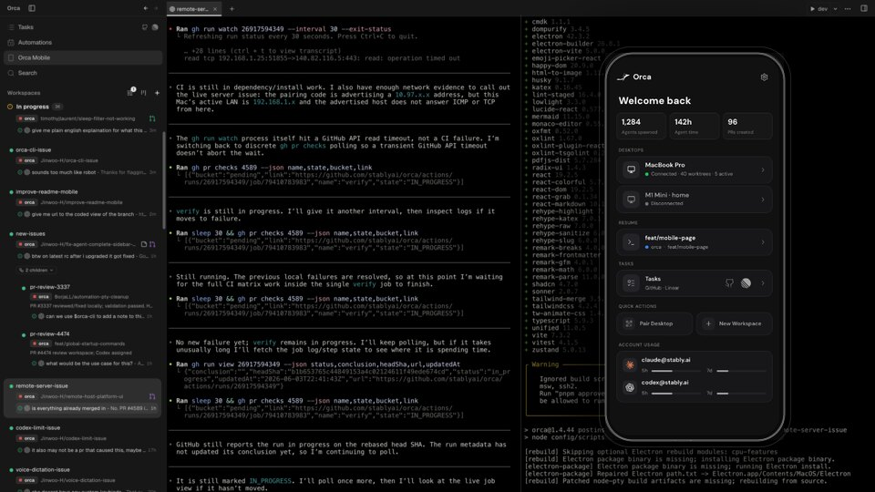
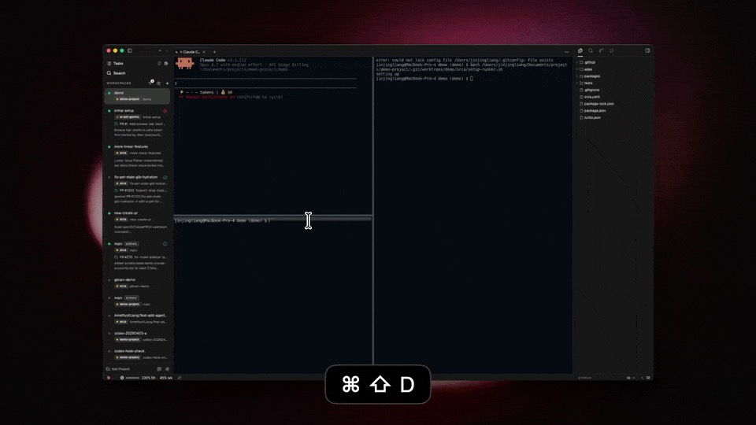
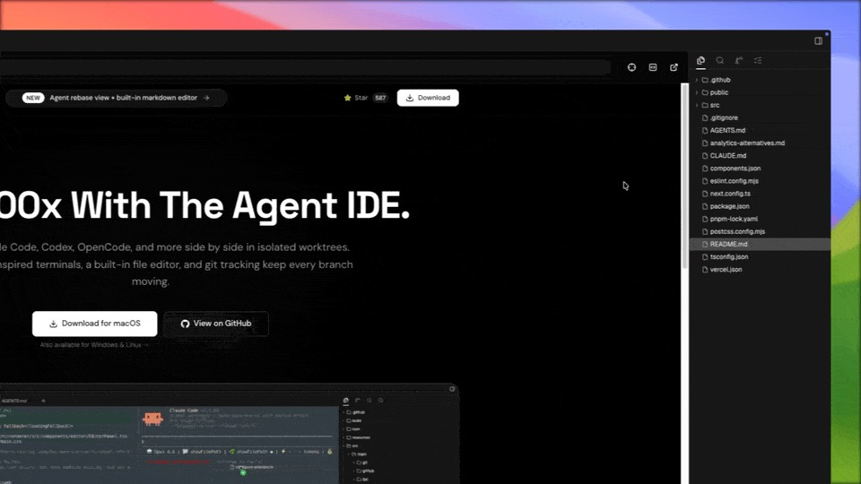
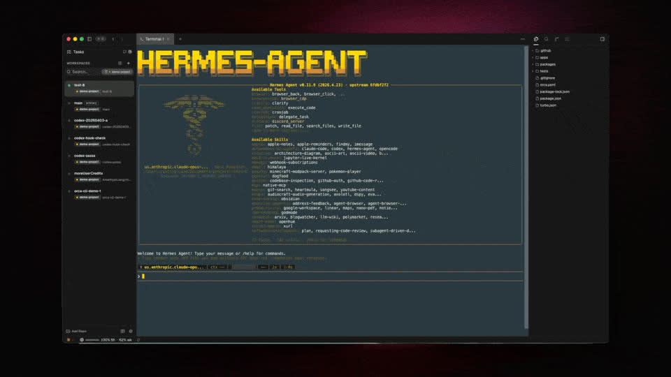
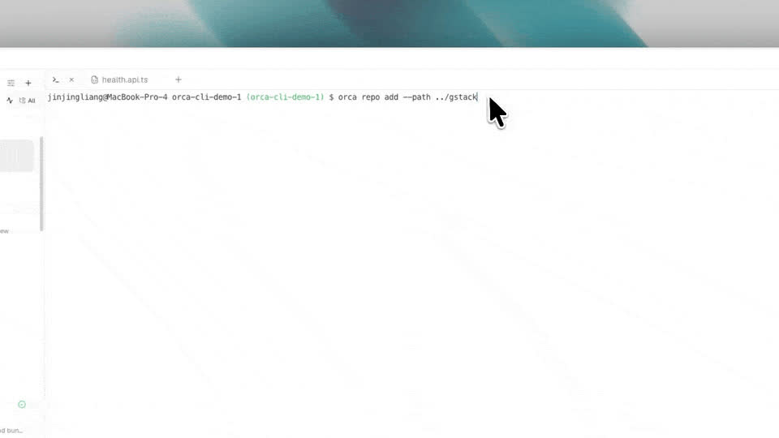
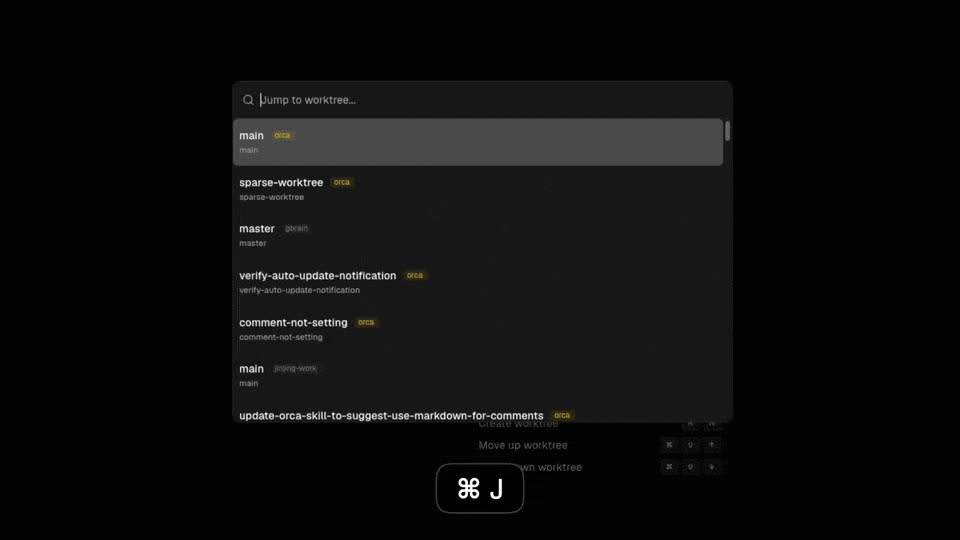
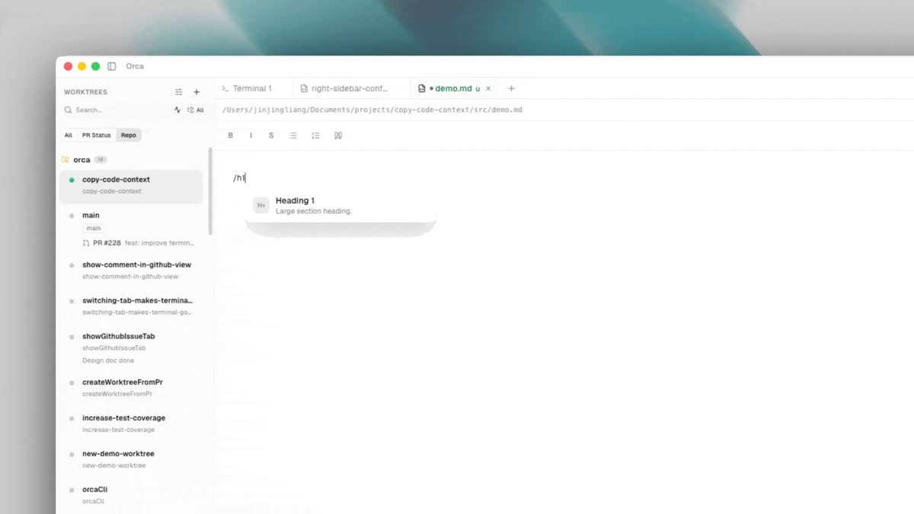
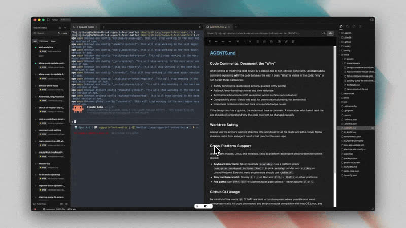

<h1 align="center">
  <a href="https://onOrca.dev"></a> Orca
</h1>

<p align="center">
  
  <a href="https://discord.gg/fzjDKHxv8Q"></a>
  <a href="https://x.com/orca_build"></a>
</p>

<p align="center">
  <a href="../../README.md">English</a> · <a href="README.zh-CN.md">中文</a> · <a href="README.ja.md">日本語</a> · <a href="README.ko.md">한국어</a> · <a href="README.es.md">Español</a>
</p>

<p align="center">
  <strong>100x 빌더를 위한 AI 오케스트레이터.</strong><br/>
  Claude Code, Codex, Grok, Antigravity, OpenCode를 여러 리포지토리에서 나란히 실행하세요. 각 에이전트는 자체 worktree에서 실행되고 한곳에서 추적됩니다.<br/>
  <strong>macOS, Windows, Linux</strong>에서 사용할 수 있습니다.
</p>

<p align="center">
  <a href="#설치"><strong>다운로드 🐋</strong></a>
</p>

<p align="center">
  
</p>

## 지원 에이전트

Orca는 모든 CLI 에이전트를 지원합니다(_아래 목록에만 한정되지 않습니다_).

<p>
  <a href="https://docs.anthropic.com/claude/docs/claude-code"><kbd> Claude Code</kbd></a> &nbsp;
  <a href="https://github.com/openai/codex"><kbd> Codex</kbd></a> &nbsp;
  <a href="https://x.ai/cli"><kbd> Grok</kbd></a> &nbsp;
  <a href="https://github.com/google-gemini/gemini-cli"><kbd> Gemini</kbd></a> &nbsp;
  <a href="https://antigravity.google/docs/cli-overview"><kbd> Antigravity</kbd></a> &nbsp;
  <a href="https://pi.dev"><kbd> Pi</kbd></a> &nbsp;
  <a href="https://hermes-agent.nousresearch.com/docs/"><kbd> Hermes Agent</kbd></a> &nbsp;
  <a href="https://opencode.ai/docs/cli/"><kbd> OpenCode</kbd></a> &nbsp;
  <a href="https://block.github.io/goose/docs/quickstart/"><kbd> Goose</kbd></a> &nbsp;
  <a href="https://ampcode.com/manual#install"><kbd> Amp</kbd></a> &nbsp;
  <a href="https://docs.augmentcode.com/cli/overview"><kbd> Auggie</kbd></a> &nbsp;
  <a href="https://github.com/autohandai/code-cli"><kbd> Autohand Code</kbd></a> &nbsp;
  <a href="https://github.com/charmbracelet/crush"><kbd> Charm</kbd></a> &nbsp;
  <a href="https://docs.cline.bot/cline-cli/overview"><kbd> Cline</kbd></a> &nbsp;
  <a href="https://www.codebuff.com/docs/help/quick-start"><kbd> Codebuff</kbd></a> &nbsp;
  <a href="https://docs.continue.dev/guides/cli"><kbd> Continue</kbd></a> &nbsp;
  <a href="https://cursor.com/cli"><kbd> Cursor</kbd></a> &nbsp;
  <a href="https://docs.factory.ai/cli/getting-started/quickstart"><kbd> Droid</kbd></a> &nbsp;
  <a href="https://docs.github.com/en/copilot/how-tos/set-up/install-copilot-cli"><kbd> GitHub Copilot</kbd></a> &nbsp;
  <a href="https://kilo.ai/docs/cli"><kbd> Kilocode</kbd></a> &nbsp;
  <a href="https://www.kimi.com/code/docs/en/kimi-code-cli/getting-started.html"><kbd> Kimi</kbd></a> &nbsp;
  <a href="https://kiro.dev/docs/cli/"><kbd> Kiro</kbd></a> &nbsp;
  <a href="https://github.com/mistralai/mistral-vibe"><kbd> Mistral Vibe</kbd></a> &nbsp;
  <a href="https://github.com/QwenLM/qwen-code"><kbd> Qwen Code</kbd></a> &nbsp;
  <a href="https://support.atlassian.com/rovo/docs/install-and-run-rovo-dev-cli-on-your-device/"><kbd> Rovo Dev</kbd></a>
</p>

---

## 기능

- **로그인 불필요** — 보유한 Claude Code, Codex, Grok 또는 Antigravity 구독을 그대로 사용하세요.
- **Worktree 네이티브** — 모든 기능은 자체 worktree를 가집니다. stash나 브랜치 전환에 얽매이지 않고 즉시 만들고 전환할 수 있습니다.
- **멀티 에이전트 터미널** — 여러 AI 에이전트를 탭과 패널에서 나란히 실행하세요. 어떤 에이전트가 활성 상태인지 한눈에 볼 수 있습니다.
- **내장 소스 관리** — AI가 생성한 diff를 검토하고, 빠르게 수정하고, Orca를 떠나지 않고 커밋할 수 있습니다.
- **GitHub 통합** — PR, issue, Actions 체크가 각 worktree에 자동으로 연결됩니다.
- **SSH 지원** — 원격 머신에 연결하고 Orca에서 직접 에이전트를 실행할 수 있습니다.
- **알림** — 에이전트가 완료되거나 주의가 필요할 때 알려줍니다. 스레드를 읽지 않음으로 표시해 나중에 다시 볼 수 있습니다.

---

## 설치

### Mac, Linux, Windows

- **[onOrca.dev에서 다운로드](https://onOrca.dev)**
- 또는 **[GitHub Releases 페이지](https://github.com/stablyai/orca/releases/latest)** 에서 받기

_패키지 매니저로도 설치할 수 있습니다:_

### macOS (Homebrew)

```bash
brew install --cask stablyai/orca/orca
```

### Arch Linux (AUR)

```bash
# 사전 컴파일된 바이너리
yay -S stably-orca-bin

# GitHub 소스에서 빌드
yay -S stably-orca-git
```

---

## 모바일 Companion 앱

휴대폰에서 에이전트를 제어하세요.

<p align="center">
  <picture><source srcset="../assets/feature-wall/mobile-companion-app-showcase.gif" type="image/gif"></picture>
</p>

- **iOS:** [App Store에서 다운로드](https://apps.apple.com/us/app/orca-ide/id6766130217)
- **Android:** [GH release에서 다운로드(최신 mobile 릴리스를 찾으세요)](https://github.com/stablyai/orca/releases)

---

## 기능 쇼케이스

타일을 클릭해 각 워크플로를 살펴보세요.

<p align="center">
  <a href="https://www.onorca.dev/docs/model/worktrees"><kbd><strong>병렬 Worktree</strong><br/><br/><picture><source srcset="../assets/feature-wall/parallel-worktrees.gif" type="image/gif"></picture><br/></kbd></a> &nbsp;&nbsp;
  <a href="https://www.onorca.dev/docs/terminal"><kbd><strong>터미널 분할</strong><br/><br/><picture><source srcset="../assets/feature-wall/terminal-splits.gif" type="image/gif"></picture><br/></kbd></a><br/><br/>
  <a href="https://www.onorca.dev/docs/browser/design-mode"><kbd><strong>디자인 모드</strong><br/><br/><picture><source srcset="../assets/feature-wall/design-mode.gif" type="image/gif"></picture><br/></kbd></a> &nbsp;&nbsp;
  <a href="https://www.onorca.dev/docs/review/linear"><kbd><strong>GitHub 및 Linear 네이티브</strong><br/><br/><picture><source srcset="../assets/feature-wall/github-linear.gif" type="image/gif"></picture><br/></kbd></a><br/><br/>
  <a href="https://www.onorca.dev/docs/agents/supported"><kbd><strong>모든 CLI 에이전트</strong><br/><br/><picture><source srcset="../assets/feature-wall/cli-agents.gif" type="image/gif"></picture><br/></kbd></a> &nbsp;&nbsp;
  <a href="https://www.onorca.dev/docs/ssh"><kbd><strong>SSH Worktree</strong><br/><br/><picture><source srcset="../assets/feature-wall/ssh-worktrees.gif" type="image/gif"></picture><br/></kbd></a><br/><br/>
  <a href="https://www.onorca.dev/docs/editing/file-explorer"><kbd><strong>에이전트로 파일 드래그</strong><br/><br/><picture><source srcset="../assets/feature-wall/file-drag.gif" type="image/gif"></picture><br/></kbd></a> &nbsp;&nbsp;
  <a href="https://www.onorca.dev/docs/review/annotate-ai-diff"><kbd><strong>AI Diff 주석</strong><br/><br/><picture><source srcset="../assets/feature-wall/annotate-diff.gif" type="image/gif"></picture><br/></kbd></a><br/><br/>
  <a href="https://www.onorca.dev/docs/cli/overview"><kbd><strong>Orca CLI</strong><br/><br/><picture><source srcset="../assets/feature-wall/orca-cli.gif" type="image/gif"></picture><br/></kbd></a> &nbsp;&nbsp;
  <a href="https://www.onorca.dev/docs/settings"><kbd><strong>네이티브 검색</strong><br/><br/><picture><source srcset="../assets/feature-wall/keyboard-native.gif" type="image/gif"></picture><br/></kbd></a><br/><br/>
  <a href="https://www.onorca.dev/docs/agents/usage-tracking"><kbd><strong>계정 전환 및 사용량 추적</strong><br/><br/><picture><source srcset="../assets/feature-wall/codex-accounts.gif" type="image/gif"></picture><br/></kbd></a> &nbsp;&nbsp;
  <a href="https://www.onorca.dev/docs/editing/markdown"><kbd><strong>풍부한 리포지토리 미리보기</strong><br/><br/><picture><source srcset="../assets/feature-wall/markdown-editor.gif" type="image/gif"></picture><br/></kbd></a><br/><br/>
  <a href="https://www.onorca.dev/docs/model/tabs-panes-splits"><kbd><strong>무엇이든 분할</strong><br/><br/><picture><source srcset="../assets/feature-wall/split-screen.gif" type="image/gif"></picture><br/></kbd></a>
</p>

---

## 커뮤니티와 지원

- **Discord:** **[Discord](https://discord.gg/fzjDKHxv8Q)** 커뮤니티에 참여하세요.
- **Twitter / X:** 업데이트와 공지는 **[@orca_build](https://x.com/orca_build)** 를 팔로우하세요.
- **피드백과 아이디어:** 우리는 빠르게 출시합니다. 필요한 기능이 있나요? [새 기능을 요청](https://github.com/stablyai/orca/issues)하세요.
- **응원하기:** 이 리포지토리에 star를 눌러 일일 릴리스를 따라와 주세요.

---

## 개발

기여하거나 로컬에서 실행하고 싶으신가요? [CONTRIBUTING.md](../.github/CONTRIBUTING.md) 가이드를 확인하세요.
